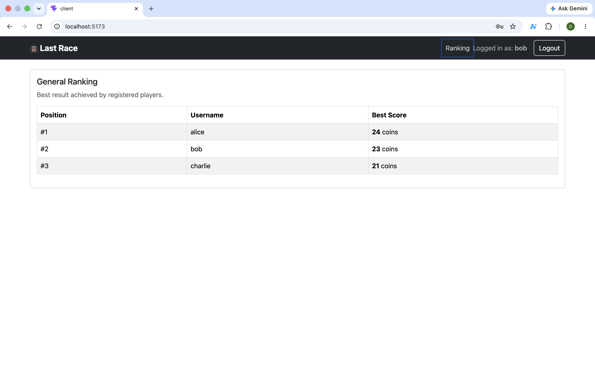
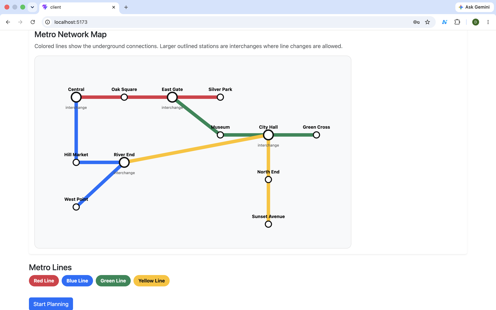

# Last Race

Web Applications I 2025/26 - Exam #1
Single-player metro route planning game inspired by Race the Rails.

## React Client Application Routes

* `/` - Single-page application entry point. The app uses conditional rendering to show Home, Login, Game, and Ranking screens.
* Home - Shows instructions. Anonymous users can only view this page.
* Login - Allows registered users to authenticate.
* Game - Contains Setup, Planning, Execution, and Result phases.
* Ranking - Shows the best score of registered players.

## Main React Components

* `App.jsx` - Main SPA controller, session state, navigation, and game flow.
* `NavigationBar.jsx` - Top navigation, login status, logout, and ranking link.
* `HomePage.jsx` - Game instructions and start/login actions.
* `LoginPage.jsx` - Login form.
* `GamePage.jsx` - Controls the game phase transitions.
* `SetupPhase.jsx` - Shows full metro network map with lines and interchanges.
* `PlanningPhase.jsx` - Shows station-only map, assigned route, timer, and segment list.
* `ExecutionPhase.jsx` - Shows route execution step by step with random events.
* `ResultPhase.jsx` - Shows final score and new game option.
* `RankingPage.jsx` - Shows general ranking.
* `Timer.jsx` - Countdown timer.

## Server HTTP APIs

* `GET /api/sessions/current`
  Returns the currently authenticated user, or 401 if not logged in.

* `POST /api/sessions`
  Logs in a user using username and password. Uses Passport.js and session cookies.

* `DELETE /api/sessions/current`
  Logs out the current user and destroys the session.

* `GET /api/network/setup`
  Returns the full metro network for the setup phase. Protected API.

* `POST /api/games`
  Starts a new game. Returns start station, destination station, stations, segments, lines, and line data.

* `POST /api/games/submit-route`
  Receives selected segment IDs and validates the route. Executes valid routes with random events and saves the score.

* `GET /api/ranking`
  Returns the best score of registered users. Protected API.

## Database Tables

* `users` - Registered users with salted and encrypted password hashes.
* `stations` - Metro stations and interchange flag.
* `lines` - Metro lines with name and color.
* `line_stations` - Ordered list of stations served by each line.
* `segments` - Pairs of connected stations.
* `events` - Random journey events and coin effects.
* `games` - Played games and final scores.
* `game_steps` - Executed route steps and associated random events.

## Seeded Users

| Username | Password |
| -------- | -------- |
| alice    | password |
| bob      | password |
| charlie  | password |

## Initial Data

The database is pre-populated with:

* 4 metro lines: Red Line, Blue Line, Green Line, Yellow Line.
* 12 stations.
* 4 interchange stations: Central, East Gate, River End, City Hall.
* 8 random events.
* 3 registered users.
* Previous successful games for at least 2 users.

## Screenshots

### Ranking Page



### Game Page



## AI Usage

AI assistance was used during development to support code organization, debugging, validation logic, UI improvements, README drafting, and checking compliance with the exam requirements.
All generated code was manually reviewed, adapted to the actual database schema, tested locally, and corrected where necessary.

## Running the Project

From the project root, open two terminals.

### Server

```bash
cd server
npm install
nodemon index.js
```

### Client

```bash
cd client
npm install
npm run dev
```

The client runs on:

```txt
http://localhost:5173
```

The server runs on:

```txt
http://localhost:3001
```

## Submission Notes

The project follows the required two-server architecture with React and Node/Express.
The SQLite database is stored in the server folder.
The project must be submitted without `node_modules`.

Final submission commands:

```bash
git add .
git commit -m "final version"
git push
git tag final
git push origin --tags
```
